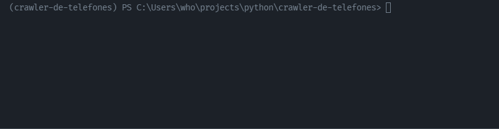

<h1 align="center"> Crawler de telefones </h1>

<h2>Sobre</h2>

Simples crawler de telefones do site de exemplo <a href="https://django-anuncios.solyd.com.br"> django-anuncios.solyd.com.br </a> que foi desenvolvido com o objetivo de compreender o funcionamento de rastreadores web, regex e multi-threading. 

